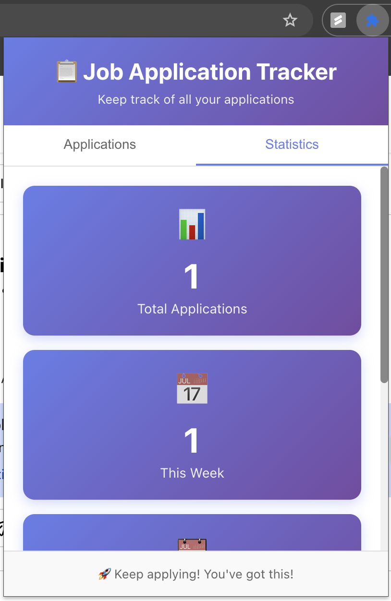

# Job Application Tracker Browser Extension

A React-based browser extension that automatically detects and tracks job application submissions across popular job sites.

## Features

- 🎯 **Automatic Detection**: Recognizes when you submit a job application on popular job sites
- 📊 **Statistics Dashboard**: View your application stats (total, this week, this month)
- 📋 **Application History**: Keep track of all your applications with company, position, and submission date
- 📥 **Export Data**: Export your application history as JSON
- 🔔 **Notifications**: Get notified when an application is tracked
- 🌐 **Wide Support**: Works with LinkedIn, Indeed, Glassdoor, Greenhouse, Lever, Workday, and more




## Supported Job Sites

- LinkedIn
- Indeed
- Glassdoor
- Greenhouse
- Lever
- Workday
- SmartRecruiters
- Jobvite
- Taleo Oracle
- And many more!

## Installation

### Development Setup

1. **Install dependencies**:
```bash
npm install
```

2. **Build the extension**:
```bash
npm run build
```

3. **Load the extension in Chrome/Edge**:
   - Open `chrome://extensions/` (or `edge://extensions/`)
   - Enable "Developer mode" (toggle in top right)
   - Click "Load unpacked"
   - Select the `build` directory from this project

### Creating Icons

Before building, create icon files in `public/icons/`:
- `icon16.png` (16x16px)
- `icon48.png` (48x48px)
- `icon128.png` (128x128px)

You can use any image editor to create these. They should be simple, recognizable icons representing job tracking or applications.

## Usage

1. **Install the extension** following the steps above
2. **Visit a job site** (e.g., LinkedIn, Indeed, Glassdoor)
3. **Submit a job application** - the extension will automatically detect it
4. **Click the extension icon** to view your tracked applications
5. **View statistics** to see your application progress

## Project Structure

```
job/
├── public/
│   ├── icons/              # Extension icons (16x16, 48x48, 128x128)
│   ├── index.html          # Popup HTML
│   ├── manifest.json       # Extension manifest
│   ├── background.js       # Background service worker
│   └── content.js          # Content script for detection
├── src/
│   ├── App.js             # Main React component
│   ├── App.css            # Styles
│   ├── index.js           # React entry point
│   └── index.css          # Global styles
├── scripts/
│   └── copy-files.js      # Build script
├── package.json
└── README.md
```

## How It Works

### Detection Mechanism

The extension uses multiple strategies to detect job applications:

1. **Form Submission Monitoring**: Watches for form submissions on job sites
2. **Keyword Detection**: Identifies forms with job application keywords
3. **AJAX/Fetch Interception**: Catches single-page application submissions
4. **URL Pattern Matching**: Recognizes common job site patterns

### Data Storage

- Applications are stored locally using Chrome's `storage.local` API
- No data is sent to external servers
- All your data stays on your device

### Data Captured

For each application, the extension tracks:
- Company name
- Job position
- Submission date and time
- Job site/URL
- Form fields (excluding passwords)

## Development

### Available Scripts

- `npm start` - Start development server
- `npm run build` - Build the extension
- `npm run copy-files` - Copy extension files to build directory

### Making Changes

1. Make your changes to the source files
2. Run `npm run build`
3. Reload the extension in Chrome (click refresh icon on extensions page)
4. Test your changes

## Privacy

This extension:
- ✅ Stores all data locally on your device
- ✅ Does not send data to external servers
- ✅ Does not track your browsing history
- ✅ Only activates on job application pages
- ✅ Does not collect passwords or sensitive information

## Troubleshooting

### Extension not detecting applications

1. Make sure the extension is enabled
2. Check that you're on a supported job site
3. Refresh the page and try again
4. Check the browser console for any errors

### Applications not showing in popup

1. Click the refresh button in the popup
2. Check browser console for errors
3. Try reinstalling the extension

### Build errors

1. Delete `node_modules` and run `npm install` again
2. Make sure you're using Node.js version 14 or higher
3. Check that all files are in the correct locations

## Contributing

Feel free to submit issues or pull requests to improve the extension!

## Future Enhancements

- [ ] Add status tracking (Applied, Interview, Rejected, Offer)
- [ ] Integration with job search APIs
- [ ] Email reminders for follow-ups
- [ ] Advanced analytics and charts
- [ ] Export to CSV/Excel
- [ ] Cloud sync across devices
- [ ] Custom job site patterns
- [ ] Application notes and tags

## License

MIT License - feel free to use and modify as needed!

## Support

If you find this extension helpful, please give it a star ⭐ and share it with others!

